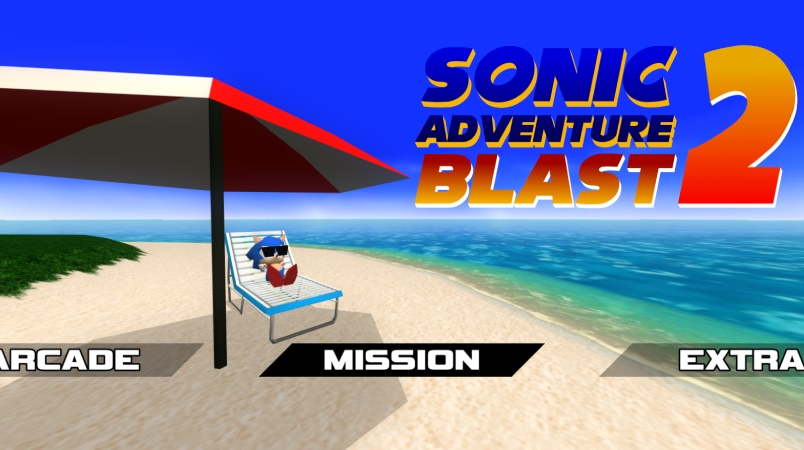
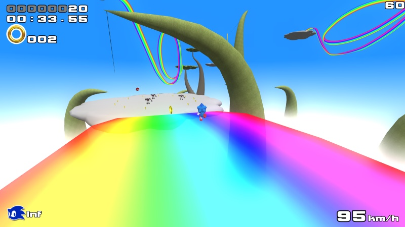
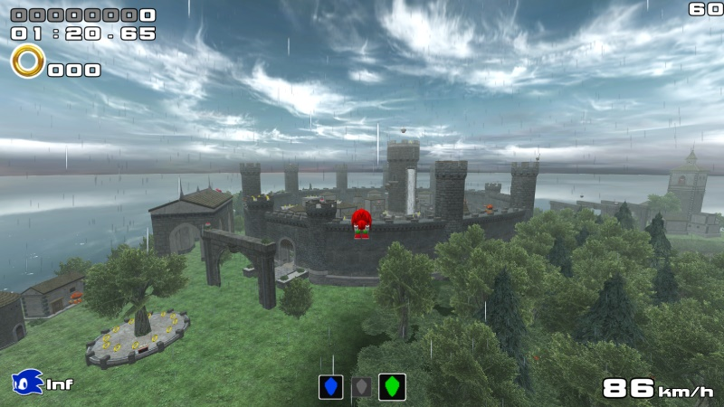
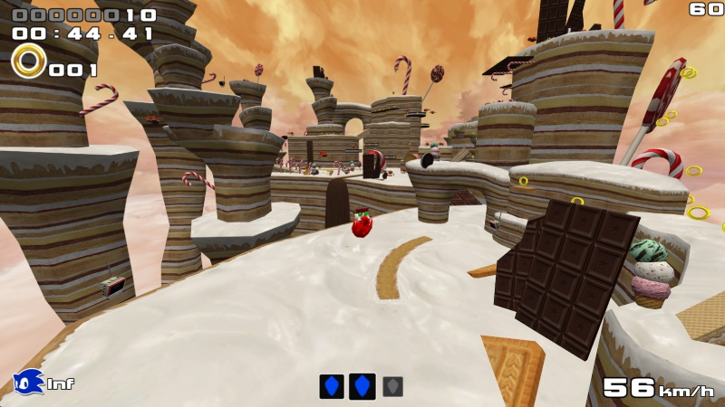
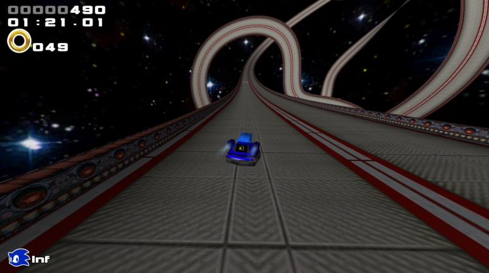
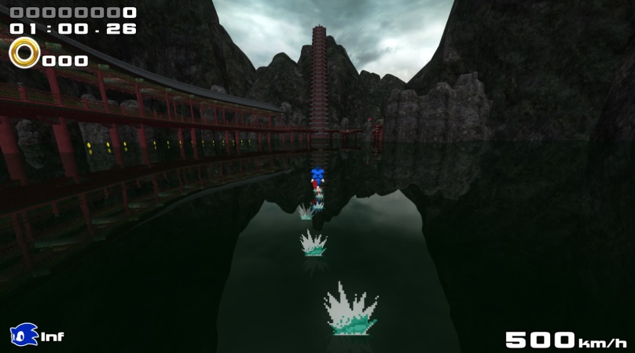
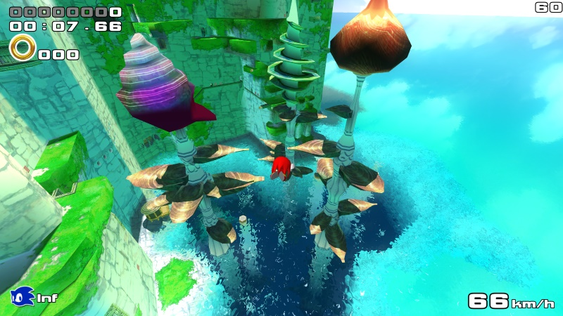

# Sonic Adventure Blast 2

Sonic Adventure Blast 2 allows you to play as Sonic, Tails, and Knuckles in adventure style gameplay.

The game contains 20 levels, each with 4 different missions.

A sequel to [Sonic Adventure Blast](https://github.com/TurtleMan64/Sonic3DGamev3), my older Sonic fangame.

## Screenshots

  
  
  
  
  
  
  
  
  
  
  
  
  

# How to compile

## Windows

1. [Download](https://github.com/TurtleMan64/SAB2/archive/refs/heads/master.zip) source code as zip.
2. Extract zip.
3. Open the `NewSonicThing.sln` in Microsoft Visual Studio 2022
4. Hit `Build->Build NewSonicThing`. This will generate the final exe.
   * Make sure to be in `Release` and `x64` mode

## Linux

1. Install Dependancies
   * `sudo apt install libglfw3-dev libogg-dev libvorbis-dev libopenal-dev libsoil-dev libsdl2-dev pkg-config`
2. Build
   * `make`
